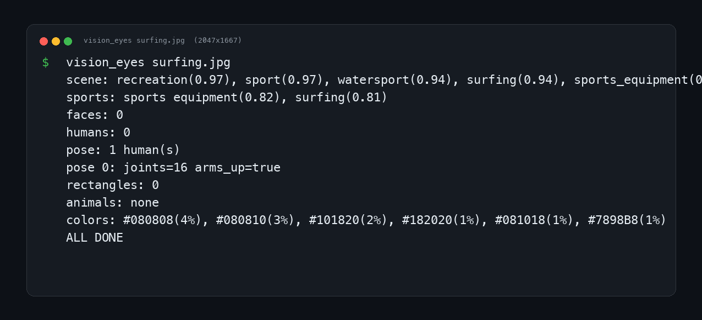
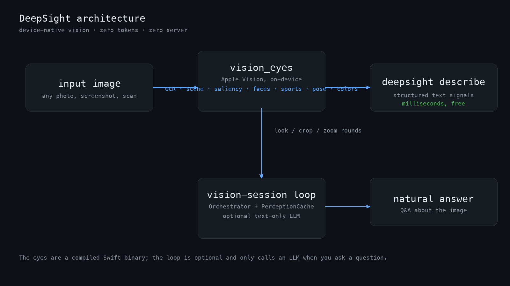

# DeepSight

[](LICENSE)
[](https://developer.apple.com/macos/)
[](pyproject.toml)
[](https://github.com/Reality-Shifting-Tech/deepsight/actions/workflows/eval.yml)

Device-native vision for text-only AI. DeepSight runs Apple Vision on your Mac, converts pixels into structured text signals (OCR, scene, sports, faces, pose, colors), and feeds them to any OpenAI-compatible model. No vision model, no GPU, no server, no per-image token cost.

The vision engine is a compiled Swift binary (`vision_eyes`); the Python package wraps it in a CLI and an optional reasoning loop.

---

## Features

- **Zero-token vision**: one `vision_eyes` run extracts everything Apple Vision can see, locally, in milliseconds.
- **No server, no API**: the eyes never call the network. Results are plain text you own.
- **Reasoning loop**: optional `Orchestrator` turns the sketch into a question-answering session where a text-only LLM can look, crop, and zoom (OpenAI-compatible backends: DeepSeek, OpenAI, local, anything).
- **Sports-aware**: the classifier maps raw Vision labels to real sports (baseball, basketball, soccer, surfing, ice hockey, ...) and reports them on a dedicated line.
- **Regression-tested**: 19-image evaluation manifest, nightly watcher, and a macOS CI job keep the eyes honest.
- **MIT licensed**, zero runtime Python dependencies beyond the standard library and pydantic.

## Requirements

| Component | Requirement |
|---|---|
| OS | macOS 14.0+ (Apple Silicon or Intel) |
| Xcode | Command Line Tools (`xcode-select --install`), for compiling the Swift binary |
| Python | 3.11+ |
| Package manager | [uv](https://docs.astral.sh/uv/) (or pip + venv) |
| Reasoning API key | Optional, only for the question-answering loop |

---

## Quickstart

```bash
git clone https://github.com/Reality-Shifting-Tech/deepsight.git
cd deepsight

# 1. install python deps (creates .venv)
uv sync

# 2. compile the vision engine (Apple Vision, on-device)
make build-eyes

# 3. point the package at the binary and describe an image
export DEEPSIGHT_VISION_BIN="$PWD/eval/.cache/vision_eyes"
uv run deepsight describe path/to/your/image.jpg
```

`deepsight describe` prints the scene, any detected text, and the people/object counts. For the full signal dump (sports line, pose, colors, saliency), run the binary directly:

```bash
"$DEEPSIGHT_VISION_BIN" path/to/your/image.jpg
```

`deepsight doctor` verifies the binary, the Python package, and the reasoning backend configuration.

### Terminal demo

`vision_eyes` output on a public-domain surfing photo. The `sports:` line is the sports-aware classifier; `pose:` comes from Vision's human-body detection.



---

## How it works



1. `vision_eyes` runs Apple Vision requests (OCR, scene classification, saliency, face/body detection, colors) on the full frame, the salient region, and grid cells.
2. Results are flattened into a compact text sketch. The eyes never leave your machine.
3. `deepsight describe` prints that sketch. That's the whole package if you just need signals.
4. For Q&A, the `Orchestrator` hands the sketch to a text-only LLM. The model can request crops and zoom regions; the loop reruns the eyes on those regions and continues until it has an answer. A `PerceptionCache` dedupes repeated regions across the session.

## Library: vision-session loop

Give a text-only LLM the ability to see, in a few lines:

```python
from deepsight.backends import NativeVisionBackend, ReasoningBackend
from deepsight.cache import PerceptionCache
from deepsight.orchestrator import Orchestrator
from deepsight.config import get_settings

settings = get_settings()  # reads DEEPSIGHT_* env vars + optional .env

vision = NativeVisionBackend(bin_path=settings.vision_bin)
reasoning = ReasoningBackend(
    base_url=settings.reasoning_base_url,
    api_key=settings.reasoning_api_key,      # any OpenAI-compatible key
    model=settings.reasoning_model,          # default deepseek-v4-flash
)
session = Orchestrator(
    vision=vision,
    reasoning=reasoning,
    cache=PerceptionCache(),
    max_look_rounds=settings.max_look_rounds,
)

result = session.run(
    "https://example.com/photo.jpg",        # or a local path / PIL image
    user_text="What is the person holding, and is there any text?",
)
print(result.answer)
print(result.total_tokens())
```

The loop is optional. Without a reasoning key, `describe` still works fully offline.

---

## Configuration

All settings are environment variables (or a `.env` file in the repo root). Only `DEEPSIGHT_VISION_BIN` matters for offline use.

| Variable | Default | Description |
|---|---|---|
| `DEEPSIGHT_VISION_BIN` | `vision_eyes` | Path to the compiled Swift binary |
| `DEEPSIGHT_REASONING_BASE_URL` | `https://api.deepseek.com/v1` | Any OpenAI-compatible endpoint |
| `DEEPSIGHT_REASONING_API_KEY` | *(empty)* | Key for the reasoning backend |
| `DEEPSIGHT_REASONING_MODEL` | `deepseek-v4-flash` | Model name |
| `DEEPSIGHT_REASONING_TEMPERATURE` | `0.2` | Sampling temperature |
| `DEEPSIGHT_REASONING_MAX_TOKENS` | `1024` | Per-turn output budget |
| `DEEPSIGHT_REASONING_TOOL_ROUND_MAX_TOKENS` | `1024` | Budget for tool-call rounds |
| `DEEPSIGHT_MAX_LOOK_ROUNDS` | `5` | Max look/crop/zoom rounds per session |
| `DEEPSIGHT_SKETCH_ENABLED` | `true` | Include the vision sketch in prompts |
| `DEEPSIGHT_CACHE_ENABLED` | `true` | Cache repeated regions per session |
| `DEEPSIGHT_CACHE_TTL_SECONDS` | `3600` | Perception cache TTL |

---

## Regression eval

The eyes are held to a 19-image public-domain manifest across three tiers:

- **Tier 0 (eyes)**: raw binary output against per-image expectations. Currently **18/19 images, 44/45 checks (97.8%)**.
- **Tier 1 (reasoning loop)**: blind descriptions by the text-only model, scored on required/forbidden facts. Currently **17/19, 108/110 (98.2%)**, ~$0.06 per run.
- **Tier 2 (CI)**: `make eval-eyes-ci` runs tier 0 on every push via [GitHub Actions](.github/workflows/eval.yml) (macOS runner compiles the Swift source from scratch).
- **Nightly watcher**: a cron job (`eval/nightly.py`) reruns both tiers daily and only reports regressions. Gap-tagged entries (currently: B&W 1964 tennis photo, a deliberate taxonomy limitation) are tracked without failing the suite.

```bash
make eval-eyes        # tier 0, local
make eval-eyes-ci     # tier 0, CI-safe (no golden photos needed)
uv run python eval/run_loop_eval.py   # tier 1 (needs DEEPSIGHT_REASONING_API_KEY)
python eval/nightly.py                # nightly watcher (regression diff)
```

Details, per-image expectations, and the gaps ledger live in [eval/](eval/).

---

## Development

```bash
make test          # pytest (unit tests, no macOS APIs required)
make lint          # ruff
make typecheck     # mypy
make all           # test + lint + typecheck
make build-eyes    # compile the Swift binary
```

The Swift source ships in the repo at `scripts/vision_eyes.swift`; `make build-eyes` is the canonical compile command. See [CONTRIBUTING.md](CONTRIBUTING.md) before opening a PR.

## Troubleshooting

| Symptom | Fix |
|---|---|
| `eyes binary not found` | `make build-eyes`, then set `DEEPSIGHT_VISION_BIN` to the built binary |
| Compile fails: SDK not found | Install Xcode Command Line Tools: `xcode-select --install` |
| Reasoning loop errors | Set `DEEPSIGHT_REASONING_API_KEY` (and `DEEPSIGHT_REASONING_BASE_URL` if not using DeepSeek) |
| New images not detected | Add the image to `eval/images/` and an entry to `eval/manifest.json`, then `make eval-eyes` |

---

## License and credits

MIT, see [LICENSE](LICENSE). Vision functionality is built on Apple's Vision framework. Third-party notices and dependency licenses are in [THIRD_PARTY_NOTICES.md](THIRD_PARTY_NOTICES.md). Release history is in [CHANGELOG.md](CHANGELOG.md).
