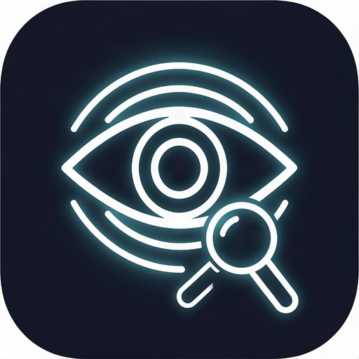
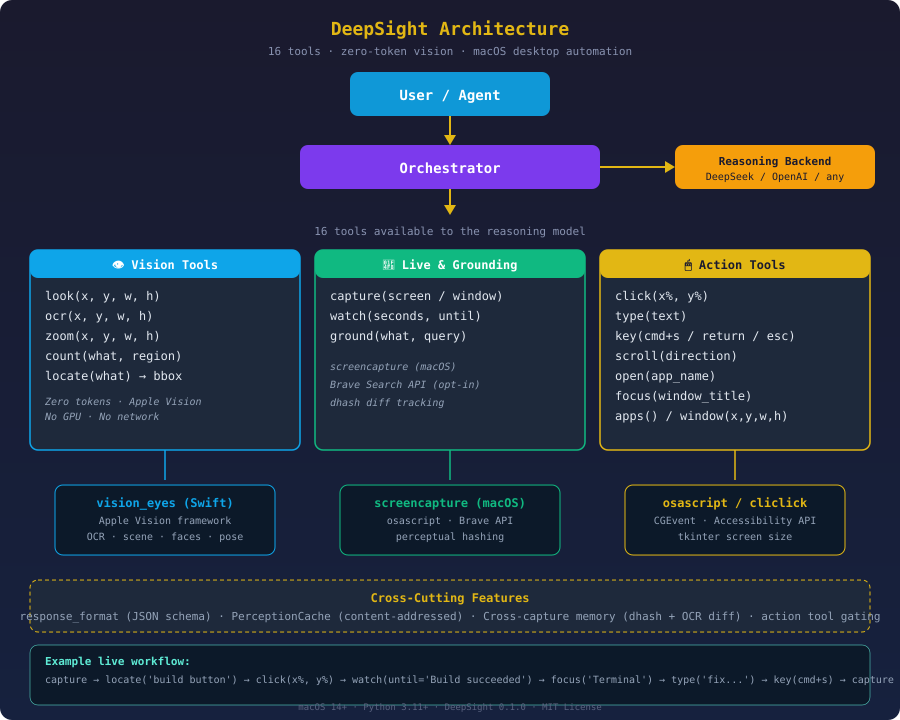

<p align="center">
  
</p>

# DeepSight

[](LICENSE)
[](https://developer.apple.com/macos/)
[](pyproject.toml)
[](https://github.com/Reality-Shifting-Tech/deepsight/actions/workflows/eval.yml)

> **Give DeepSeek (or any text-only model) eyes and hands.** DeepSight connects your existing LLM setup to the real world — it can look at images you send, take screenshots of your desktop, read text on screen, click buttons, type into fields, open apps, and search the web to verify facts. All vision runs on-device through Apple Vision: zero tokens, zero GPU, no image data ever leaves your machine.



---

## Features

DeepSight exposes **16 tools** to the reasoning model, organized into four layers.

### 👁️ Vision tools — see the screen

| Tool | What it does |
|------|-------------|
| `look` | Describe a rectangular region of the image |
| `ocr` | Transcribe all text in a region, exactly as written |
| `zoom` | Zoom into a region for small-detail inspection |
| `count` | Count objects matching a description in a region |
| `locate` | Find an object by description and return its bounding box (x%, y%, w%, h%) |

All vision tools are zero-token — they use Apple Vision via a compiled Swift binary on your Mac. No network, no GPU, no API calls.

### 📸 Live capture tools — see what's happening now

| Tool | What it does |
|------|-------------|
| `capture` | Screenshot the screen (or a specific window) and analyze it with the full vision pipeline |
| `watch` | Monitor the screen over time — captures at an interval, uses perceptual hashing to skip identical frames, returns a timeline of changes. Optional `until` param stops when target text appears |

After `capture`, all subsequent vision tools operate on the captured screen. The model can capture, inspect, act, then capture again.

### 🌐 Grounding tools — verify facts

| Tool | What it does |
|------|-------------|
| `ground` | Search the web for a claim or entity, fetch the top result, and return a verification summary with citations |

Powered by Brave Search. Gated by `DEEPSIGHT_SEARCH_API_KEY` — degrades gracefully when unset.

### 🖱️ Action tools — interact with the desktop

| Tool | What it does |
|------|-------------|
| `click` | Click at a position (x%, y% — matches locate output) |
| `type` | Type text into the focused input field |
| `key` | Press keyboard shortcuts (`cmd+s`, `return`, `escape`, `ctrl+c`) |
| `scroll` | Scroll the active window (direction, clicks) |
| `open` | Launch or activate an application by name |
| `focus` | Bring a window to front by matching its title |
| `apps` | List all visible applications and their window titles |
| `window` | Resize or reposition a window using % screen coordinates |

Action tools use macOS `osascript` (built-in) or `cliclick` (recommended: `brew install cliclick`). Requires Accessibility permission in System Settings.

---

## Demo: build a game with AI

```python
from deepsight.orchestrator import Orchestrator
from deepsight.backends import NativeVisionBackend, ReasoningBackend, ComputerUseBackend

# Set up the agent
vision = NativeVisionBackend(bin_path="vision_eyes")
reasoning = ReasoningBackend(
    base_url="https://api.deepseek.com/v1",
    api_key="sk-...",
    model="deepseek-v4-flash",
)
agent = Orchestrator(vision=vision, reasoning=reasoning, computer=ComputerUseBackend())

# The model uses all 16 tools autonomously:
agent.run(
    image_url="data:image/png;base64,...",
    user_text="Open a terminal, create a new game project, build it, "
              "then capture the result and tell me if it compiled.",
    response_format={"type": "json_object"},
)
```

The model will: open Terminal, type commands, capture the screen to check output, locate errors, fix them, rebuild, and report the result.

---

## Quickstart

```bash
git clone https://github.com/Reality-Shifting-Tech/deepsight.git
cd deepsight

# 1. install python deps
uv sync

# 2. compile the vision engine (Apple Vision, on-device)
make build-eyes

# 3. describe an image
export DEEPSIGHT_VISION_BIN="$PWD/scripts/vision_eyes"
uv run deepsight describe path/to/image.jpg

# 4. check connectivity
uv run deepsight doctor
```

### One-shot describe

```bash
uv run deepsight describe path/to/image.jpg
```

Output: OCR text, scene classification, face/human/animal counts, detected sports, color palette, bounding boxes for every detected object.

### Vision session (reasoning loop)

```python
from deepsight.backends import NativeVisionBackend, ReasoningBackend
from deepsight.orchestrator import Orchestrator

vision = NativeVisionBackend(bin_path="vision_eyes")
reasoning = ReasoningBackend(
    base_url="https://api.deepseek.com/v1",
    api_key="sk-...",
    model="deepseek-v4-flash",
)

session = Orchestrator(vision=vision, reasoning=reasoning)
result = session.run(
    image_url="https://example.com/screenshot.png",
    user_text="What's on the screen? Find any text and describe the layout.",
)
print(result.content)
```

---

## Architecture

1. **Reasoning model** receives the user's request plus tool definitions for all 16 tools.
2. **Vision tools** (look, ocr, zoom, count, locate) route through the `Perception` module, which shells `vision_eyes` — the compiled Apple Vision binary — for zero-token analysis.
3. **Live capture** (`capture`, `watch`) uses macOS `screencapture` to grab the screen, stores the result as the active image, and runs the full vision pipeline on it.
4. **Action tools** (click, type, key, scroll, open, focus, apps, window) route through `ComputerUseBackend`, which uses macOS `osascript` or `cliclick` for desktop automation.
5. **Grounding** (`ground`) uses `SearchBackend` to search the web via Brave Search API.
6. **Structured output** — pass `response_format` to get JSON-schema-constrained answers.
7. **Cross-capture memory** — perceptual hashing (dhash) + OCR set diff tracks what changed between captures.
8. **Perception cache** deduplicates repeated vision queries within a session.

---

## Tool reference

### `look(x, y, w, h)`
Inspect a region of the image. All coordinates are percentages (0-100). Returns a description of what's there.

### `ocr(x, y, w, h)`
Transcribe text in a region. Exact transcription including line breaks.

### `zoom(x, y, w, h)`
Upscale and inspect a region for small details.

### `count(what, [x, y, w, h])`
Count objects matching a description. Pass a `what` string like "people", "red cars", "buttons".

### `locate(what, [x, y, w, h])`
Find an object by description. Returns normalized bounding box coordinates plus confidence. Uses Apple Vision's on-device detection (faces, humans, animals, text, rectangles, salient objects). Example: `locate("the login button")` returns `Login (85%): x=40% y=60% w=20% h=8%`.

### `capture([region])`
Take a screenshot. Optional `region`: `"screen"` (default) or a window title substring (e.g. `"Terminal"`, `"Safari"`). Returns a full scene analysis with OCR, detected objects, and changes since the last capture.

### `watch([seconds=10, interval=1, until=""])`
Monitor the screen over time. Uses perceptual hashing to skip identical frames. Optional `until` stops early when text appears. Returns a timeline.

### `ground(what, [query])`
Search the web to verify a fact. Fetches the top result's page content for deep verification. Requires `DEEPSIGHT_SEARCH_API_KEY`.

### `click(x, y)`
Click at screen position (percentages). Use after `locate` to click on a specific object. Requires Accessibility permission.

### `type(text)`
Type text into the currently focused input field.

### `key(keys)`
Press keyboard shortcuts: `"cmd+s"`, `"return"`, `"escape"`, `"ctrl+c"`, `"tab"`, `"up"`, `"down"`.

### `scroll([direction="down", clicks=3])`
Scroll the active window.

### `open(name)`
Launch or activate an application: `"Terminal"`, `"Safari"`, `"Xcode"`, `"Finder"`.

### `focus(window)`
Bring a window to front by title substring. Use `apps` first to see available windows.

### `apps()`
List all visible running applications and their window titles. Returns something like:
```
Safari (2 windows)
  - DeepSight README — Edit
  - GitHub — Pull Requests
Terminal (1 window)
  - bash — npm run build
```

### `window([name, x, y, w, h])`
Resize or reposition a window. All values in % of screen. Example: `window(x=25, y=25, w=50, h=50)` centers the window.

---

## Complete example: self-driving developer loop

```python
from deepsight.backends import NativeVisionBackend, ReasoningBackend, \
    ComputerUseBackend, SearchBackend
from deepsight.orchestrator import Orchestrator
from deepsight.config import get_settings

settings = get_settings()

agent = Orchestrator(
    vision=NativeVisionBackend(bin_path=settings.vision_bin),
    reasoning=ReasoningBackend(
        base_url=settings.reasoning_base_url,
        api_key=settings.reasoning_api_key,
        model=settings.reasoning_model,
    ),
    computer=ComputerUseBackend(),
    search=SearchBackend(api_key=settings.search_key),
)

result = agent.run(
    image_url="data:image/png;base64,...",
    user_text=(
        "Open Terminal. Run 'npm run dev'. Wait for the dev server to start. "
        "Capture the browser at localhost:5173. Describe what you see. "
        "If there are errors, read them, fix the code, and try again. "
        "Tell me when the app is running and what it looks like."
    ),
)
```

---

## Configuration

All settings are environment variables (or a `.env` file in the repo root). Variables use the `DEEPSIGHT_` prefix.

| Variable | Default | Description |
|----------|---------|-------------|
| `DEEPSIGHT_VISION_BIN` | `vision_eyes` | Path to the compiled Apple Vision binary |
| `DEEPSIGHT_REASONING_BASE_URL` | `https://api.deepseek.com/v1` | OpenAI-compatible chat endpoint |
| `DEEPSIGHT_REASONING_API_KEY` | *(empty)* | API key for the reasoning model |
| `DEEPSIGHT_REASONING_MODEL` | `deepseek-v4-flash` | Model name for the reasoning loop |
| `DEEPSIGHT_SEARCH_API_KEY` | *(empty)* | Brave Search API key for `ground` tool |
| `DEEPSIGHT_MAX_LOOK_ROUNDS` | `5` | Max tool rounds per vision session |
| `DEEPSIGHT_SKETCH_ENABLED` | `true` | Include scene sketch in prompts |
| `DEEPSIGHT_CACHE_ENABLED` | `true` | Cache repeated vision regions |
| `DEEPSIGHT_CACHE_TTL_SECONDS` | `3600` | Perception cache expiry |

---

## Development

```bash
make test          # pytest (60+ tests, no macOS APIs)
make lint          # ruff (zero-warning policy)
make typecheck     # mypy
make all           # test + lint + typecheck
make build-eyes    # compile scripts/vision_eyes.swift
```

The Swift source is at `scripts/vision_eyes.swift`; `make build-eyes` is the canonical compile. Tests must not require live model endpoints — backends are mocked.

---

## Troubleshooting

| Symptom | Fix |
|---------|-----|
| `vision binary not found` | `make build-eyes`, set `DEEPSIGHT_VISION_BIN` |
| Vision tools return no results | Check `deepsight doctor` |
| Action tools fail silently | Grant Accessibility permission in System Settings > Privacy & Security > Accessibility |
| `click` / `type` don't work | `brew install cliclick` for more reliable input |
| `ground` returns unavailable | Set `DEEPSIGHT_SEARCH_API_KEY` (get one free at [brave.com/search/api](https://brave.com/search/api/)) |
| `capture` returns empty | Check `screencapture` permissions (Terminal needs Screen Recording permission) |
| Compile fails: SDK not found | `xcode-select --install` |

---

## License

MIT — see [LICENSE](LICENSE). Built on Apple's Vision framework. Third-party notices in [THIRD_PARTY_NOTICES.md](THIRD_PARTY_NOTICES.md). Release history in [CHANGELOG.md](CHANGELOG.md).
